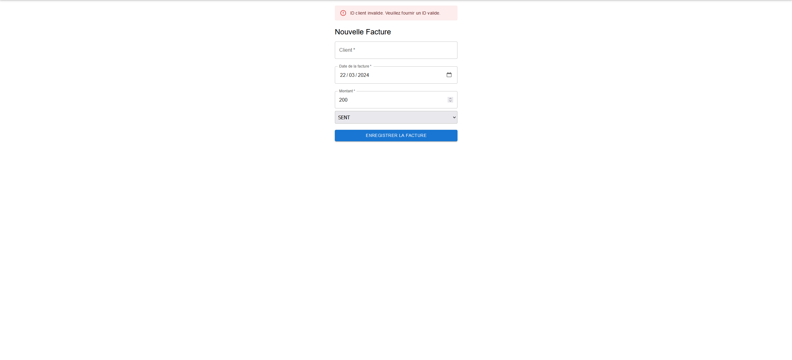

# Système de gestion de clients

Un système de gestion de clients simple construit avec React et TypeScript.

## Mise en route

Pour commencer avec le projet, suivez ces étapes :

1. **Clonez le dépôt :**
    ```bash
    git clone https://github.com/walidaddouche/amu-frontend-eval
    ```

2. **Installez les dépendances :**
    ```bash
    cd app
    npm install
    ```

3. **Lancez le serveur de développement :**
    ```bash
    npm start
    ```

Le serveur sera disponible à l'adresse http://localhost:3000.

## Tests unitaires

Les tests unitaires sont écrits avec Jest et React Testing Library. Pour exécuter les tests, utilisez la commande suivante :

```bash
npm test
```
## Structure du projet

Le projet est structuré de la manière suivante :

- **src** : dossier contenant le code source du projet
    - **components** : dossier contenant les composants React
        - **CustomerCard** : affiche les informations d'un client sous forme de carte.
        - **CustomerList** : affiche la liste des clients.
        - **CustomerForm** : affiche le formulaire de création ou d'édition d'un client.
    - **utils** : dossier contenant les utilitaires et les types

- **public** : dossier contenant les fichiers publics de l'application

- **App.tsx** : fichier principal de l'application

- **package.json** : fichier de configuration du projet

## Résultats des tests cypress 


### Fonctionnalités
- Creation de client avec des messages d'erreurs si les champs ne sont pas remplis correctement ou si le client existe déjà.

<br> </br>
- Consultation des informations d'un client inclut également les détails de ses factures, y compris leur statut actuel et leur montant.
- Possibilité de trier les factures selon différents critères tels que leur statut, leur montant ou leur date.

  <br> </br>

- Creation de facture pour un client avec des messages d'erreurs si les champs ne sont pas remplis correctement.

- Message d'erreur au cas où l'id du client n'est pas valide 

<br> </br>

- Consultation de la liste des clients.

### Améliorations possibles
- Ajouter une fonctionnalité de recherche pour les clients.
- Ajouter une fonctionnalité de recherche pour les factures.
## Auteur
ADDOUCHE WALID
